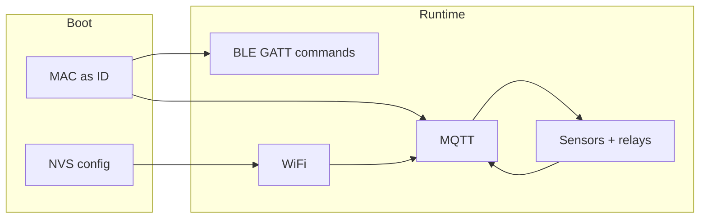

# Nanban ESP32 — Commands, Payloads, and How It Works

This document describes how the firmware exposes configuration over **BLE**, how **MQTT** carries telemetry and control, and what **JSON** shapes the device expects or publishes.

---

## High-level flow

1. **Boot** — NVS is opened; the device MAC is read (Bluetooth base MAC, formatted as `AA:BB:CC:DD:EE:FF`) and used as identity.
2. **Defaults vs NVS** — Wi‑Fi SSID/password and MQTT broker URI default to values in `app_config.h` unless overridden in NVS (`nanban_cfg` namespace).
3. **BLE** — Starts first as a GATT server; the **advertising / GAP device name** is `NANBAN-` plus the device MAC string. Clients can send **plain-text command lines** on the RX characteristic; responses are sent as **notifications** on the TX characteristic (after the client enables notifications via the TX CCCD). A short delay (~300 ms) runs before Wi‑Fi starts so the stack can register and begin advertising on the shared RF (same idea as starting BLE before Wi‑Fi in `dryfire-fw-app`).
4. **Wi‑Fi** — Connects using the SSID/password chosen at boot (`wifi_layer_start`). **Firmware does not block in `app_main` until Wi‑Fi is connected** — BLE stays usable for provisioning while association is in progress or failing.
5. **MQTT** — The client is started right after Wi‑Fi is brought up; it **retries automatically** until the network is available (see reconnect settings in `app_config.h` / `mqtt_layer_start`). A FreeRTOS task publishes telemetry every **3 seconds** when **both** Wi‑Fi and MQTT are connected.



**Important:** `SET_WIFI`, `SET_BROKER`, and `RESET_NVS` update NVS immediately, but **Wi‑Fi and MQTT are started in `app_main` using values read once at startup**. To apply new Wi‑Fi or broker settings, **reboot the device** after changing NVS.

---

## BLE GATT interface

| Item | Value |
|------|--------|
| Service UUID (16-bit) | `0xABF0` |
| RX characteristic (write) | `0xABF1` — host sends UTF-8 **command lines** here |
| TX characteristic (notify) | `0xABF2` — device sends UTF-8 **responses** as notifications |
| RX max length | 192 bytes (including null terminator handling in firmware) |
| TX notify max length | 256 bytes (responses are capped smaller in practice, ~220 chars) |
| Local MTU | 500 (negotiated with client) |

Advertising uses a **raw** legacy PDU (flags + **Complete Local Name**, same idea as `dryfire-fw-app` `ble_update_advertising_name`). The 16-bit service UUID **`0xABF0`** is on the GATT server after you connect — filter scanners by **local name** (`NANBAN-` + MAC, e.g. `NANBAN-80:B5:4E:E8:B9:0A`) or connect and discover services.

On ESP32-S3, Wi‑Fi and BLE share the radio. Firmware calls `ble_layer_ensure_advertising()` from the Wi‑Fi event handler when the STA gets an IP and when it disconnects, so connectable advertising is re-started after RF contention. You can still scan and connect over BLE **before** Wi‑Fi has connected.

### Enabling responses

Subscribe to notifications on **TX (`0xABF2`)** and write **0x0001** to the Client Characteristic Configuration descriptor for that characteristic. Until notifications are enabled, `ble_layer_send_notification` will not deliver data.

### Command line format

- One line per write (or per processed buffer): **command**, optional **arg1**, optional **arg2**, separated by **whitespace**.
- Leading/trailing whitespace on the line is trimmed.
- **Quoted arguments** allow spaces inside `arg1` / `arg2`: use double quotes `"..."`.

The parser splits into at most **three** tokens (`cmd`, `arg1`, `arg2`). There is no fourth argument token.

---

## BLE commands (reference)

All commands are **case-sensitive** (compared with `strcmp` to literals like `SET_WIFI`).

### `SET_WIFI`

Stores Wi‑Fi credentials in NVS.

| Argument | Required | Description |
|----------|----------|-------------|
| `arg1` | Yes | SSID (use quotes if it contains spaces) |
| `arg2` | Yes | Password |

**Examples**

```text
SET_WIFI MyNetwork mypassword
SET_WIFI "Guest WiFi" "pass with spaces"
```

**Notification responses**

- Success: `OK SET_WIFI ssid="<ssid>" password_len=<n>`
- Failure: `ERR SET_WIFI usage: ...` or `ERR SET_WIFI <esp_err_name>`

**Limits** — NVS buffers: SSID up to **32** characters stored (+ NUL), password up to **64** characters stored (+ NUL); see `NVS_MAX_SSID_LEN` / `NVS_MAX_PASS_LEN` in `app_config.h`.

---

### `SET_BROKER`

Stores the MQTT broker URI in NVS (must include scheme and port, e.g. `mqtt://host:1883`).

| Argument | Required | Description |
|----------|----------|-------------|
| `arg1` | Yes | Full broker URI |

**Example**

```text
SET_BROKER "mqtt://broker.example.com:1883"
```

**Notification responses**

- Success: `OK SET_BROKER broker="<uri>"`
- Failure: `ERR SET_BROKER usage: ...` or `ERR SET_BROKER <esp_err_name>`

**Limit** — broker string up to **127** characters stored (+ NUL); `NVS_MAX_BROKER_LEN`.

---

### `RESET_NVS`

Clears stored Wi‑Fi and MQTT broker keys in the `nanban_cfg` namespace (implementation-specific; see `nvs_config_reset_all()`).

**Example**

```text
RESET_NVS
```

**Notification responses**

- Success: `OK RESET_NVS`
- Failure: `ERR RESET_NVS <esp_err_name>`

---

### Unknown commands

Any other first token yields:

```text
ERR UNKNOWN_CMD "<command>"
```

---

## MQTT topics and QoS

Defined in `app_config.h`:

| Topic | Direction | Purpose |
|-------|-----------|---------|
| `nanban/control` | Subscribe (device) | Incoming **control** JSON |
| `nanban/data` | Publish (device) | Outgoing **telemetry** JSON |

Publish uses **QoS 1**, no retain (see `mqtt_layer_publish_data`).

The device only processes control messages whose **topic** matches the configured control topic. Payloads must be **valid JSON** with the fields below.

### MQTT reconnect (client behavior)

`mqtt_layer_start()` configures the ESP-MQTT client with:

| Setting | Source | Meaning |
|---------|--------|--------|
| Auto-reconnect | `MQTT_AUTO_RECONNECT_DEFAULT` in `app_config.h` (passed as `bool` to `mqtt_layer_start`) | When enabled (`1`), the stack reconnects after a drop; when disabled (`0`), `network.disable_auto_reconnect` is set. |
| Reconnect interval | `MQTT_RECONNECT_TIMEOUT_MS_DEFAULT` in `app_config.h` (or any positive `reconnect_timeout_ms` argument; `≤ 0` falls back to the default) | Milliseconds between reconnect attempts (`network.reconnect_timeout_ms`). |

To change behavior, edit the macros in `app_config.h` or adjust the arguments in `main_app.c` where `mqtt_layer_start` is called.

---

## MQTT control payload (inbound)

Published by your backend/app to `nanban/control`. The device parses with `json_layer_parse_control_payload`.

### JSON shape

| Field | Type | Description |
|-------|------|-------------|
| `macAddress` | string | **Optional.** If omitted or not a string, the command is applied without MAC filtering. If present as a string, it must **exactly match** this device (`AA:BB:CC:DD:EE:FF` style). |
| `control` | string | Actuator name (see below) |
| `action` | string | `"ON"` or `"OFF"` (relay high only for `ON`) |

### Supported `control` values

| `control` | GPIO (from `app_config.h`) | Behavior |
|-----------|------------------------------|----------|
| `fogger` | `FOGGER_GPIO` (GPIO 5) | Sets fogger relay |
| `motor` | `MOTOR_GPIO` (GPIO 18) | Sets motor relay |
| `pump` | `PUMP_GPIO` (GPIO 19) | Sets pump relay |

Other `control` strings are accepted by the parser but **ignored** by `apply_control_state` (no relay change, no error over MQTT).

### Examples

With MAC filter (recommended on a shared broker):

```json
{"macAddress":"AA:BB:CC:DD:EE:FF","control":"pump","action":"ON"}
```

Minimal (no `macAddress` — any subscriber on the topic will act):

```json
{"control":"pump","action":"ON"}
```

If `control` / `action` are missing or not strings, the message is dropped. If `macAddress` is a string and does not match, the message is dropped. A non-string `macAddress` field logs a warning and the MAC check is skipped.

---

## MQTT telemetry payload (outbound)

Published every **3 s** to `nanban/data` when Wi‑Fi and MQTT are connected and a sensor read succeeds. Built by `json_layer_build_feedback_payload`.

### JSON shape

| Field | Type | Description |
|-------|------|-------------|
| `macAddress` | string | Device MAC |
| `soil` | number (JSON) | Soil moisture **0..100** (float, two decimal places in output) |
| `water` | string | Water sensor: `"HIGH"` or `"LOW"` |
| `temperature` | number | DHT11 temperature (°C, integer) |
| `humidity` | number | DHT11 humidity (% , integer) |
| `foggerState` | string | `"ON"` or `"OFF"` |
| `motorState` | string | `"ON"` or `"OFF"` |
| `pumpState` | string | `"ON"` or `"OFF"` |

### Example

```json
{"macAddress":"AA:BB:CC:DD:EE:FF","soil":45.67,"water":"LOW","temperature":24,"humidity":60,"foggerState":"OFF","motorState":"OFF","pumpState":"ON"}
```

---

## Default configuration (compile-time)

If NVS has no overrides, defaults in `app_config.h` apply (example values in tree — change for your deployment):

- Wi‑Fi: `WIFI_SSID_DEFAULT` / `WIFI_PASS_DEFAULT`
- Broker: `MQTT_BROKER_DEFAULT` (e.g. `mqtt://broker.emqx.io:1883`)
- MQTT reconnect: `MQTT_AUTO_RECONNECT_DEFAULT` / `MQTT_RECONNECT_TIMEOUT_MS_DEFAULT`

---

## NVS keys (reference)

Namespace: `nanban_cfg`

| Key | Content |
|-----|---------|
| `wifi_ssid` | SSID string |
| `wifi_pass` | Wi‑Fi password |
| `mqtt_broker` | MQTT broker URI string |

---

## Firmware entry point

`app_main()` lives in **`main/main_app.c`**. That file is the one listed in `main/CMakeLists.txt`; ESP-IDF does not require the file to be named `main.c`. There is no second monolithic `main.c` in this project.

**Typical startup order:** `nvs_config_init` → identity/MAC → load Wi‑Fi + broker strings → sensor/relay init → `ble_layer_start` → ~300 ms delay → `wifi_layer_start` → `mqtt_layer_start` (with reconnect options) → `sensors_layer_start_telemetry_task`. There is **no** `while (!wifi_layer_is_connected())` gate before MQTT; the MQTT client connects when the interface is ready.

---

## File map (where this is implemented)

| Concern | Primary files |
|---------|----------------|
| BLE — app include | `main/ble.h` (wraps `ble_layer.h` + debug handler decl) |
| BLE GATT, command line parsing, notify | `main/ble_layer.c` |
| BLE NVS debug command implementation | `main/ble_debug_layer.c` |
| Fogger/motor/pump GPIO + state | `main/relay_layer.c`, `main/relay_layer.h` |
| Periodic MQTT telemetry (sensor read + JSON publish) | `main/sensors_layer.c` (`sensors_layer_start_telemetry_task`) |
| Application wiring (`app_main`) | `main/main_app.c` |
| MQTT connect/subscribe/publish | `main/mqtt_layer.c` |
| JSON build/parse | `main/json_layer.c` |
| NVS get/set | `main/nvs_config.c` |
| Topics, GPIO, NVS limits | `main/app_config.h` |
